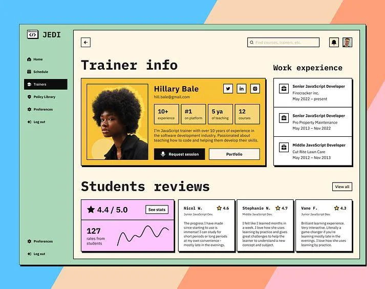

At Markov ML, I spent three years building an agentic AI platform that transformed how data teams work with complex datasets. What started as a simple vision—make AI/ML accessible through no-code workflows—evolved into a platform connecting 100+ data sources with 100+ operations including AI/LLM transformations, search, model training, and document processing.

Here's what I learned building AI systems at scale.

## The No-Code Vision

The core idea was simple: enable non-technical users to build sophisticated AI workflows without writing code. Think Zapier, but for AI and data operations.


*A workflow interface showing connected data operations*

Users could drag and drop operations, connect data sources, apply transformations, and deploy AI models—all through a visual interface. Behind the scenes, we handled the complexity of orchestration, scaling, and infrastructure.

## Connecting 100+ Data Sources

One of our biggest technical challenges was building a unified abstraction layer over vastly different data sources:

- SQL databases (Postgres, MySQL, Snowflake)
- NoSQL stores (MongoDB, DynamoDB)
- Cloud storage (S3, GCS, Azure Blob)
- APIs (REST, GraphQL, webhooks)
- Streaming sources (Kafka, Kinesis)
- SaaS tools (Salesforce, HubSpot, Slack)

Each source had its own authentication mechanism, rate limits, data formats, and quirks. We built a plugin architecture that allowed us to add new sources without touching core infrastructure.

## Data Intelligence Platform

Beyond simple data movement, we built a data intelligence layer that could automatically:

- **Assess data quality** - detecting anomalies, missing values, outliers
- **Profile datasets** - statistical summaries, distributions, correlations
- **Vectorize content** - for semantic search and similarity
- **Extract entities** - PII detection, NER, topic modeling
- **Train models** - automated ML pipelines with hyperparameter tuning

Each operation was designed to be composable—you could chain them together to build complex workflows.

## The Relabeling Challenge

One project I'm particularly proud of is the data relabeling workbench. Machine learning models need labeled data, but manual labeling is slow and expensive.

We built a system that combined three approaches:

```python
# Manual labeling with smart suggestions
labels = suggest_labels(unlabeled_data)

# Rule-based weak supervision
weak_labels = apply_rules(data, user_rules)

# Automated relabeling using existing models
auto_labels = relabel_with_model(data, confidence_threshold=0.9)
```

The key insight was that you could use a combination of these methods to dramatically reduce manual labeling effort while maintaining quality.

## Deployment Flexibility

As we onboarded enterprise customers, we realized that SaaS wasn't enough. Some customers needed on-premises deployment for security or compliance reasons.

We built support for deploying Markov ML on any cloud environment, including AWS GovCloud. This meant containerizing everything, managing secrets properly, and building deployment automation that worked across different cloud providers.

## Lessons Learned

**Abstraction is hard but worth it.** Building the right abstractions took time and many iterations, but it paid off by making it easy to add new capabilities without breaking existing workflows.


**Infrastructure is a product feature.** Users don't care about your infrastructure until it breaks. Reliability, performance, and observability aren't nice-to-haves—they're core to the product experience.


**Start with the user, not the technology.** We could have built a technically impressive system that nobody wanted to use. Instead, we focused on solving real problems for data teams and built the technology to support that.

**Documentation and examples matter.** A no-code platform is only as good as its documentation. We invested heavily in examples, tutorials, and templates that helped users understand what was possible.

## What's Next

The future of AI platforms is about making powerful capabilities accessible to more people. No-code is part of that, but so is better abstraction, smarter automation, and more flexible deployment options.

As AI models get more capable, the challenge shifts from "can we do this?" to "how do we make this easy and reliable for everyone?"

That's the problem I'm still working on.
